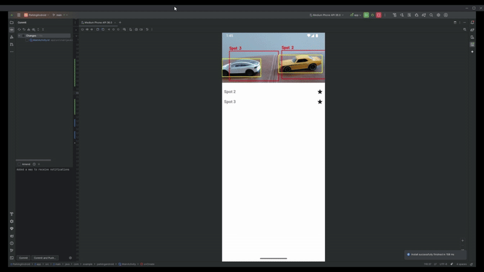

# Smart Parking Lot Monitoring System - Android App

 

*In the list, a filled star indicates an occupied spot, while an unfilled star indicates a free spot. Notifications alert when a spot becomes available. Gif also does not provide audio but notification does ping*

## Project Description

This is the Android application component of the Smart Parking Lot Monitoring System. Its primary function is to provide users with real-time updates about parking spot availability, alert them to new vacancies, and allow them to view the parking lot. It connects to a Python FastAPI backend that processes video to determine occupancy.

## Purpose within the System

The Android app serves as a mobile interface for users to:
* Quickly check the current status of all parking spots.
* Receive timely push notifications when a monitored spot becomes free.
* View a live video feed of the parking area.

## Technologies

This project is built using Native Android development with Kotlin and leverages several key libraries:

* **Platform:** Native Android
* **Language:** Kotlin (`.kt`)
* **Networking (REST API):** Retrofit with Moshi Converter for fetching initial spot data and registering FCM tokens.
* **Networking (WebSocket):** OkHttp for establishing and managing the WebSocket connection for live spot status updates.
* **Asynchronous Operations:** Kotlin Coroutines and `lifecycleScope` for managing background tasks like network calls and WebSocket handling.
* **UI Components:**
    * RecyclerView with ListAdapter and DiffUtil for efficiently displaying the list of parking spots.
    * WebView for displaying the live MJPEG video stream from the backend.
* **Push Notifications:** Firebase Cloud Messaging (FCM) for receiving alerts about spot vacancies. Includes a `FirebaseMessagingService` to handle incoming messages and display system notifications.
* **Permissions:** Handles runtime permissions for `POST_NOTIFICATIONS` (Android 13+).
* **Dependency Injection (Implicit):** Using an `object` for `ApiClient` provides a simple singleton for network service access.

## Features

* **Real-time Spot Status Display:** Connects to the backend via WebSocket to receive live updates on parking spot status (occupied/free) and displays them in a list.
* **Initial Spot Data Fetch:** Fetches the initial list of parking spots and their statuses from the backend API using Retrofit.
* **FCM Push Notifications for Vacancies:**
    * Retrieves the device's FCM token and registers it with the backend.
    * Receives push notifications via Firebase Cloud Messaging when a parking spot becomes available.
    * Displays a system notification to the user indicating which spot is free.
* **Live Video Feed:** Displays the MJPEG video stream from the backend within a `WebView` component.
* **Basic UI:** Presents a list of spots with visual status indicators and integrates the video feed.

## Current Status and Progress

The Android app has successfully implemented core functionalities:
* Connection to the backend for initial data and real-time WebSocket updates for spot statuses.
* Display of spot statuses (filled/unfilled) in a RecyclerView.
* Registration of the device for FCM notifications.
* **Successful reception and display of push notifications** when a spot becomes free, triggered by the backend. Logic to prevent notification spamming for the same vacancy event is in place on the backend.
* **Successful display of the live MJPEG video feed** from the backend in a `WebView`.
* Basic error handling for network operations.

## Future Goals

* **User Preferences:**
    * Allow users to configure notification preferences (e.g., only for specific spots, quiet hours).
* **UI/UX Enhancements:**
    * Improve the overall user interface for better visual appeal and user experience.
    * Potentially integrate the spot list more directly with a visual map of the parking lot if spot coordinate data becomes available.
* **Robustness:**
    * Enhance WebSocket reconnection logic further.
    * Add more comprehensive error handling and user feedback.
    * Thoroughly test background notification reliability across different Android versions and device states.

## Setup and Installation

1.  **Prerequisites:**
    * Android Studio (latest stable version recommended).
    * Access to the backend API and video stream (ensure the backend, including the Dockerized services, is running and accessible from your Android emulator or device, typically `http://10.0.2.2:8000/` for the emulator connecting to localhost).
2.  **Clone the Repository:**
    ```bash
    git clone [https://github.com/BrannonKLuong/ParkingAndroid](https://github.com/BrannonKLuong/ParkingAndroid) # TODO: Verify this is the correct URL for your Android app's repository
    cd YourAndroidProjectDirectoryName # Navigate into the cloned Android project directory
    ```
3.  **Configure Firebase:**
    * Go to the [Firebase console](https://console.firebase.google.com/) and create a new project (or use an existing one).
    * Add an Android app to your Firebase project:
        * Register app with package name: `com.example.parkingandroid` (or your app's actual package name as defined in `build.gradle`).
        * Download the generated `google-services.json` file.
    * Place the downloaded `google-services.json` file in the `app/` directory of your Android Studio project (e.g., `YourAndroidProjectDirectoryName/app/google-services.json`).
    * Ensure your project-level `build.gradle` and app-level `build.gradle` files have the necessary Firebase dependencies and Google Services plugin applied (these should already be in your project).
4.  **Backend API Endpoint:** Verify that the `BASE_URL` in `ApiClient.kt` (usually located in `app/src/main/java/com/example/parkingandroid/network/ApiClient.kt`) is set to `http://10.0.2.2:8000/`. This is correct for an Android emulator connecting to a backend running on your development machine's `localhost`.
5.  **Open in Android Studio:** Open the Android project directory in Android Studio. It should sync Gradle dependencies automatically.
6.  **Build and Run:** Build and run the project using Android Studio on an Android emulator (API 24+ recommended, with Google Play Services for FCM) or a physical device. Ensure the emulator/device has network connectivity.

---

You can copy and paste this directly into your `README.md` file for the Android application.
